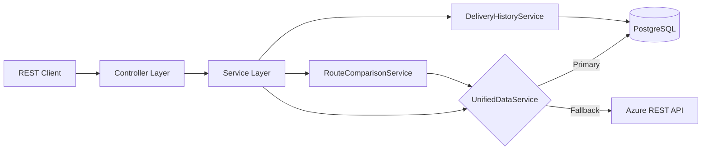
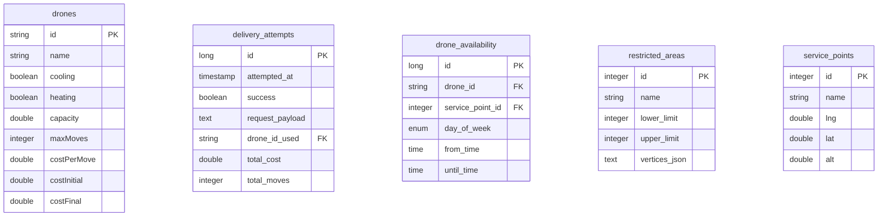

# Drone Delivery Service

A Spring Boot backend for planning and simulating drone deliveries. 

The system manages a fleet of drones, calculates delivery routes while avoiding restricted airspace, and tracks delivery history. It uses a hybrid data architecture - PostgreSQL for persistence with an external Azure REST API as a fallback data source and initial seeding.

## Tech Stack

| Category | Technology |
|----------|------------|
| Language | Java 21 |
| Framework | Spring Boot 3.4 |
| Database | PostgreSQL 16 |
| Build | Maven |
| Containers | Docker, Docker Compose |
| API Docs | Swagger / OpenAPI |
| Other | Lombok, Gson, slf4j|

## Architecture

The service follows a layered architecture with a hybrid data layer that prioritises local PostgreSQL storage but can fall back to fetching from an external REST API.



## Data Model



## Key Services

**PathfindingService** - Implements the A* algorithm to find routes between locations while avoiding restricted airspace. Uses 16 compass directions and checks for both point containment and line-segment intersection with no-fly zones.

**LocationService** - Computational geometry utilities: point-in-polygon detection (ray casting), line segment intersection, and distance calculations. Used throughout the system for spatial reasoning.

**DroneService** - Handles drone fleet queries with constraint-based filtering (capacity, cooling/heating requirements, cost limits, scheduling). Determines which drones are available for a given delivery request.

**DeliveryPlanningService** - Orchestrates delivery planning. Can allocate a single drone for multiple deliveries, or distribute deliveries across multiple drones when needed. Calculates costs and validates constraints.

**GeoJsonService** - Exports the current system state (restricted areas, service points, recent deliveries) as GeoJSON for visualisation in tools like [geojson.io](https://geojson.io).

## Running

```bash
# Build and run with Docker Compose (includes PostgreSQL)
docker compose up --build
```

- API: `http://localhost:8080`
- Swagger UI: `http://localhost:8080/swagger-ui.html`
- PostgreSQL: `localhost:5432`

Demo data is seeded on startup from the external ILP service.

### Environment Variables

Set `ILP_SERVICE_URL` to point to the external data source (see `.env.example`).

## API Overview

The API is split into two controllers:

**ServiceController** - Core delivery operations:
- `POST /calcDeliveryPath` - Plan a delivery and get the flight path
- `POST /compareRoutes` - Compare all available drone options for a delivery
- `GET /deliveries/history` - View past delivery attempts
- `GET /data/geojson` - Export current state for map visualisation

**AdminController** - Fleet management:
- CRUD operations for drones, service points, restricted areas
- Drone capability and availability scheduling
- Query drones by attributes

## Stopping

```bash
docker compose down        # Stop containers
docker compose down -v     # Stop and remove database volume
```